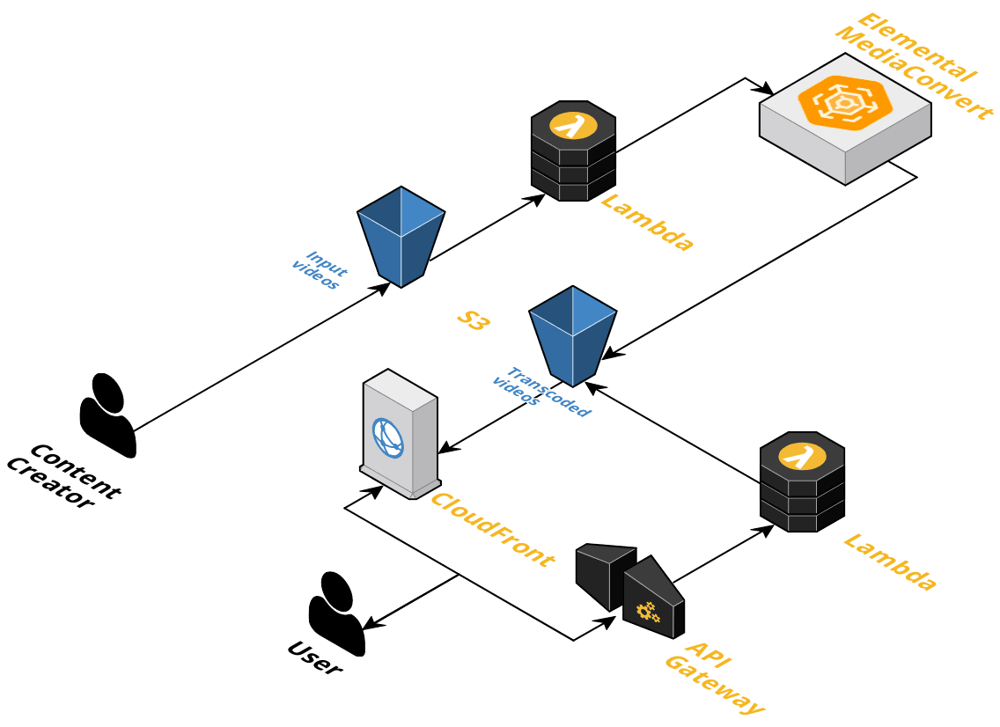

# AWS Workflow - Video-On-Demand

## Description

This workflow will create buckets and an API to manage VOD content with AWS.

An input bucket will be created and used to store raw video content.
Once a file is uploaded to this bucket, a Lambda function will be triggered and it will create a MediaConvert job to transcode the video.
The transcoded video will then be stored into an output bucket.
API Gateway will let you make API requests to get the list of transcoded videos available in the output bucket.

## Infrastructure



#### Elemental MediaConvert

AWS Elemental MediaConvert is used to transcode raw files for VOD

#### API Gateway

API Gateway will create endpoint to link a lambda function to them

#### Lambda

A Lambda function will be created for each API endpoint (managed by API Gateway) and another Lambda function will be used to create transcoding jobs with MediaConvert

#### CloudFront

CloudFront is used to serve private content from S3 and cache content

## Instructions

### Pre-requirements

#### AWS CLI

All the steps requires you to have [AWS CLI](https://docs.aws.amazon.com/cli/latest/userguide/cli-chap-install.html) installed.

It also needs your credentials to be set inside `~/.aws/credentials`

#### S3 Bucket

A bucket will be needed for Serverless framework. This bucket will be used to store data during deployment.

The other buckets will be created during deployment.

#### CloudFront Key Pair

A CloudFront key pair is needed for the presigned URLs generation. Instructions are available [here](https://docs.aws.amazon.com/AmazonCloudFront/latest/DeveloperGuide/private-content-trusted-signers.html#private-content-creating-cloudfront-key-pairs).

You will need to save the key pair ID and also the private key, they will be used in the next section for the configuration.

#### NodeJS / NPM

Instructions are available [here](https://nodejs.org/en/) to install NodeJS and NPM.

#### Serverless

Instructions are available [here](https://serverless.com/framework/docs/getting-started/) to install Serverless.

Go to your AWS Console and create an access key for Serverless by following [this tutorial](https://serverless.com/framework/docs/providers/aws/guide/credentials#creating-aws-access-keys). You have details on how to use your access key with Serverless below the tutorial.

### Configuration

A configuration file named `config.json` is available to customize this workflow. Two modifications are mandatory (see below), once you have made them, you can rename the other values in this configuration file based on your needs.

#### Deployment

You need to set as deployment bucket the name of the bucket created above, so Serverless can push content to this bucket for deployment. Also, you can change the region you want to deploy this workflow.

#### Distribution

First, you will need to add information about the key pair generated above into the configuration file:
- “keyPairId” must be the generated key pair ID
- “privateKey” is the content of the private key that you have downloaded (Note: Each new line should be replaced by \n, so the private key can be stored as one single line)

Then, you will have to do a first deployment so Serverless can setup everything. Once you have done the first deployment, you will need to go to the AWS Console and search for the CloudFront distribution created with this workflow. A base URL will be displayed, this value needs to be stored as “baseURL” in configuration file.

### Deployment

1. Install required libraries
````sh
$> npm install
````

2. You can now deploy the workflow with the following command:

````sh
$> serverless deploy
$> serverless s3deploy # This command will add events notification support to trigger Lambda for transcoding
````

## API Documentation

A detailed documentation about API is available [here](.documentation/API.md)

## User management / Cognito

Users are managed using AWS Cognito.

Two Cognito users pools are used:
- `vod-workflow-user-pool-users`: For every endpoints
- `vod-workflow-user-pool-admins`: For POST and DELETE requests

## Roadmap

- Get CloudFront distribution automatically
